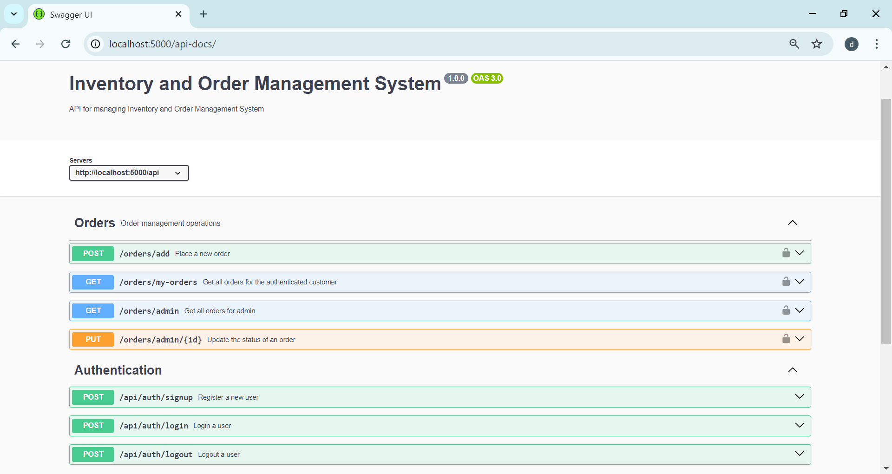
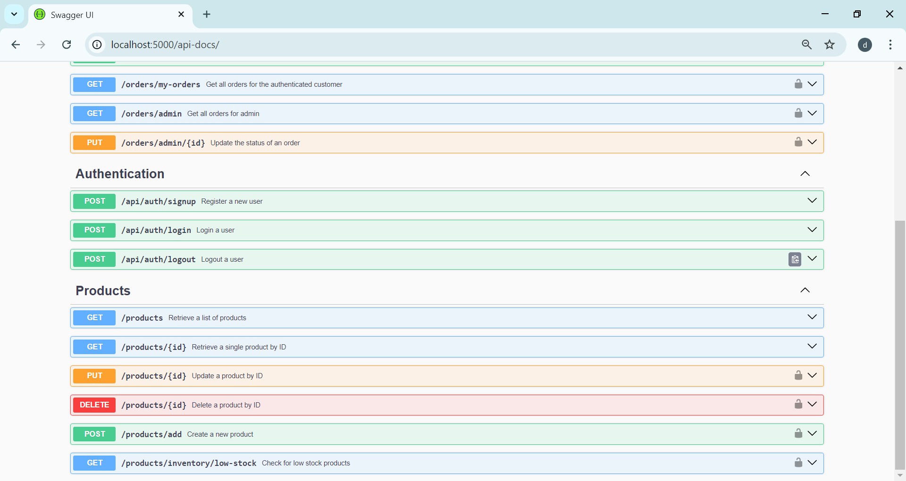

 <h1>Inventory and Order Management System</h1>
 

   ## Expense Swagger UI
   
   
   <br>
    

# E-Commerce Backend System

## Overview

This project is a backend system for an e-commerce application that supports user authentication, inventory management, and order processing. The system is built with Node.js, Express, and MongoDB, providing a robust platform for managing users, products, and orders.

## Features

- **User Authentication**: 
  - JWT-based authentication for both customers and admins.
  - Role-based access control:
    - **Admin**: Manage inventory and view all orders.
    - **Customer**: Browse products, place orders, and view order history.

- **Inventory Management**: 
  - CRUD operations for products.
  - Admins can manage stock levels with alerts for low-stock products.

- **Order Management**: 
  - Customers can place orders with multiple products and view order statuses (Pending, Shipped, Delivered).
  - Admins can update order statuses and view all customer orders.

## Technologies Used

- Node.js
- Express
- MongoDB
- Mongoose
- JSON Web Tokens (JWT)
- Render (for deployment)

## Getting Started

### Prerequisites

- Node.js and npm installed on your machine.
- MongoDB database (local or cloud).

### Installation

1. Clone the repository:
   ```bash
   git clone https://github.com/Devanshiballar/Inventory_Order_Management_System.git


### Setup .env file
MONGO_URL=Your_mongo_url
PORT=Sevice_port
NODE_ENV=NODE_ENVIRINMENT
JWT_SECRET=jwt_secret


### Run this app locally

shell
npm run build


### Start the app

shell
npm start
